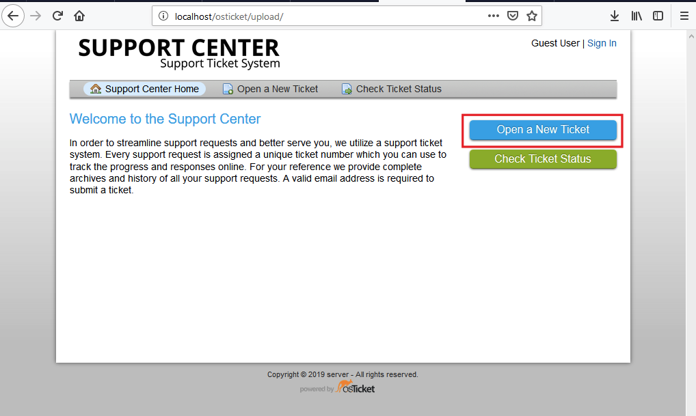

## OSTICKET

### Preparación para instalar

-Necesitas descargarte el [OSTICKET](https://osticket.com/download/) desde su web de descargas.

-Descargamos [Xampp](https://www.apachefriends.org/es/download.html) desde su web oficial.

*empezaremos instalando Xampp*

*Despues vamos a la ruta de htdocs de xampp, y extraemos la carpeta de OSTICKET\(que antes nos hemos descargado\)en htdocs*

### configuración preinstalación

*iremos a la ruta "localhost/osticket/upload" y nos saldra esta pantalla, le dariamos a continue:*

*Después nos sale un error que se soluciona cambiando el nombre de dos archivos, nos sale este error:*

*modificaremos el nombre del archivo ost-sampleconfig.php por ost-config.php*

*una vez echo eso ya nos dejaria ir al siguiente paso*

### instalación

*nos saldría la siguiente pantalla y pondremos lo que querramos\(como el email el idioma y el usuario Admin\).*

*Y aqui configuraremos la base de datos.*

*Despues nos sale este error que se soluciona de la siguiente manera:*

*Vamos al panel de xammpp y pulsamos en el config de mysql*

*Dentro del fichero, añadiriamos la siguiente linea:*

*Y ya habriamos terminado solo faltarian los permisos\(en mi caso estoy en windows asi que ire a la ruta de osticket y desde powershell les dare permisos\)*

*le dariamos los permisos desde powershell*

*Una vez echo eso ya tendriamos el osticket instalado y configurado*

### ¿Como funciona?
*accedemos al panel del administrador del xampp que es la siguiente ruta:*

*si nos fijamos aqui ya tenemos el panel de adminisrador*

*crearemos un usuario*

*Y lo añadiremos*

*Ya estaria Creado*

### hacer y enviar un ticket
*crearemos un ticket entrando a la siguiente ruta y dandole a "open a new ticket"*

*Como lo hize sin registrarme,\(tambien lo puedes hacer en modo sin log in\), me pide que inserte el correo, nombre, numero de telefono y que reporte el Help Topic y una descripción*

*Y aqui vemos que lo envio el usuario prueba Melián que es Guest"invitado" el dia la hora y el reporte*

*Pulsamos encima del ticket y nos salen los detalles. El número de ticket, Ultima actualización, el estado, el asunto\(que fue el que escribi anteriormente\), el departamento y la asignación *

